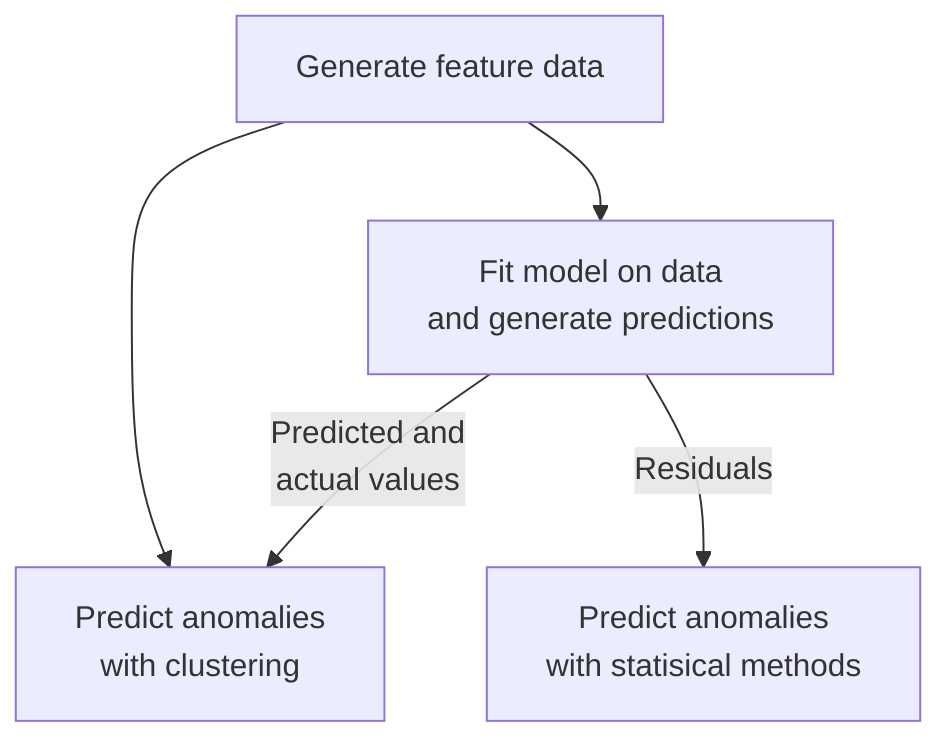
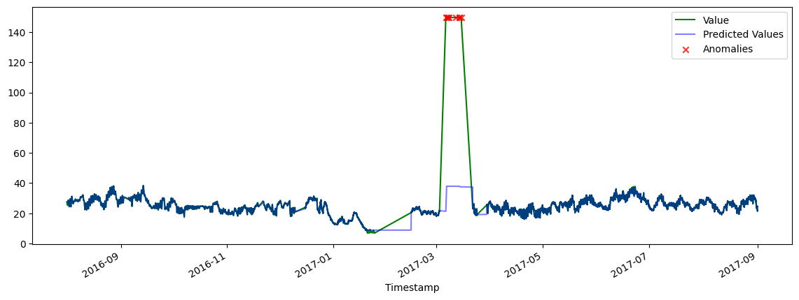

## Performance Analysis of Predictive Models for Sensor Fault Detection: From Traditional Methods to Deep Learning Approaches

See full writeup [here](https://html-preview.github.io/?url=https://github.com/XiongCynthia/SensorFaultDetection/blob/main/writeup.html).

See code [here](https://nbviewer.org/github/XiongCynthia/SensorFaultDetection/blob/main/SensorFaultDetection.ipynb).

### Abstract

In this study, we present a comprehensive evaluation of various modeling techniques for sensor fault detection using the time series of sensor measurements. Our approach involves experimenting with combinations of a diverse range of models for predicting sensor measurements and anomalous results. For predicting measurements, we include a traditional statistical method ARMA, machine learning algorithms like random forest, gradient boosting, and k-nearest neighbors, as well as deep learning architectures including recurrent neural networks (RNNs), long short-term memory networks (LSTMs), and gated recurrent units (GRUs). For predicting anomalies, we include univariate outlier detection methods on residuals such as with z-scores and interquartile ranges, as well as multivariate outlier detection methods on predicted and actual values, such as with isolation forest and clustering techniques.

Through extensive experimentation and comparative analysis on real-world sensor datasets, we systematically assess the performance of each method in terms of computational efficiency and detection accuracy. By empirically evaluating the effectiveness of different approaches, we aim to identify the most suitable models for sensor fault detection. We aim to provide valuable insights into the strengths and limitations of each modeling technique, enabling practitioners to make informed decisions when implementing robust sensor fault detection systems in industrial environments.

### Brief Overview of Methods

We use machine learning clustering algorithms to predict anomalous data, specifically isolation forest, k-means clustering, and density-based spatial clustering of applications with noise (DBSCAN). These models are fed the new feature data, then have the smallest cluster of values be labelled as anomalous. In an altered version of this approach, values are labelled as anomalous if the cluster they are in is smaller than a set threshold.

We then try a different procedure: we add an intermediary step in the pipeline where we fit another model on the data, with the previous values as the input data $X$ and the current values as the targets $y$. Then, we use the model's predictions of all the feature data along with their associated actual values to predict anomalous data. We use a statistical time series model, the autoregressive moving-average (ARMA) model (where the targets are the endogenous values and the input data the exogenous values); machine learning regressors, using random forest, gradient boosting, and k-nearest neighbors algorithms; and deep learning models, which are a simple recurrent neural network (RNN), a long short-term memory (LSTM) network, and a gated recurrent unit (GRU) network.

### Example: A Result with Random Forest Regressor + K-Means Clustering

