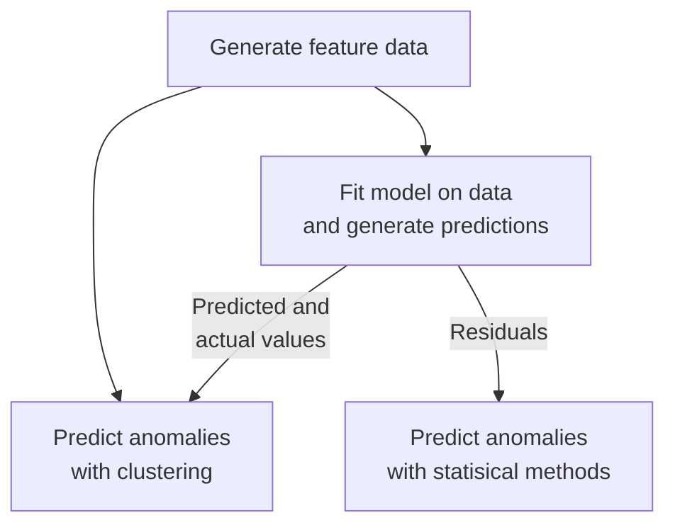

# Performance Analysis of Predictive Models for Sensor Fault Detection: From Traditional Methods to Deep Learning Approaches

## Abstract

In this study, we present a comprehensive evaluation of various modeling techniques for sensor fault detection using the time series of sensor measurements. Our approach involves experimenting with combinations of a diverse range of models for predicting sensor measurements and anomalous results. For predicting measurements, we include a traditional statistical method SARIMAX, machine learning algorithms like random forest, gradient boosting, and k-nearest neighbors, as well as advanced deep learning architectures including recurrent neural networks (RNNs), long short-term memory networks (LSTMs), and gated recurrent units (GRUs). For predicting anomalies, we include univariate outlier detection methods on residuals such as with z-scores and interquartile ranges, as well as multivariate outlier detection methods on predicted and actual values, such as with isolation forest and clustering techniques.

Through extensive experimentation and comparative analysis on real-world sensor datasets, we systematically assess the performance of each method in terms of computational efficiency and detection accuracy. By empirically evaluating the effectiveness of different approaches, we aim to identify the most suitable models for sensor fault detection. We aim to provide valuable insights into the strengths and limitations of each modeling technique, enabling practitioners to make informed decisions when implementing robust sensor fault detection systems in industrial environments.

## Introduction

Sensor fault detection is a crucial aspect of ensuring the reliability and accuracy of sensor networks. It involves identifying anomalies or faults in sensor data that may arise due to various reasons such as sensor malfunctions, environmental factors, or communication errors. De Silva et al. stress the importance of robust fault detection in sensor networks to enhance performance and reduce environmental impact (de Silva et al., 2020). Dong et al. highlight the increasing research interest in fault detection for sensor networks due to the growing demand for higher performance, safety, and reliability standards (Dong et al., 2014).

One common method involves utilizing symptom signals, pattern recognition, or analyzing the contributions of sensors to process models to detect sensor faults (Brunner et al., 2021). Additionally, researchers have explored the use of Convolutional Neural Networks (CNNs) for fault detection in aero-engine sensors, emphasizing the importance of detecting and isolating sensor faults to enhance system reliability (Du et al., 2022).

In the realm of wireless sensor networks (WSNs), distributed fault detection schemes have been developed to capitalize on the spatial correlations of sensor measurements for fault detection (Dong et al., 2014). These schemes aim to enhance fault detection accuracy and efficiency in large-scale sensor networks. Furthermore, fault detection methods based on credibility and cooperation have been suggested for WSNs in smart grids, highlighting the significance of collaborative fault detection approaches in complex systems (Shao et al., 2017). By integrating model-based algorithms with signal-based techniques, researchers have achieved effective fault detection and isolation for current sensors in various systems (Mollet et al., 2013). Moreover, the advancement of fault-tolerant control systems and fault diagnosis algorithms has been pivotal in addressing sensor faults in different applications, such as wind turbines and gas turbines (Odgaard et al., 2013; Cruz-Manzo et al., 2022). These systems aim to detect, isolate, and accommodate sensor faults in real-time to ensure the continuous operation of critical infrastructure.

Another approach to sensor fault detection involves the use of physics-informed machine learning techniques. De Silva et al. (2020) discusses the application of a moving average of the innovation covariance to identify anomalous behavior in sensor data. Additionally, the authors mention the utilization of the Dynamic Mode Decomposition (DMD) algorithm for system identification in sensor fault detection, particularly in cases with strongly nonlinear dynamics. DMD is known for extracting coherent spatio-temporal structures from complex data, making it suitable for detecting faults in sensor networks.

On the other hand, Dong et al. (2014) focus on distributed filtering and fault detection in sensor networks. They propose algorithms that enable distributed and localized fault identification by leveraging information from neighboring sensors. The authors also discuss the importance of distributed estimation and fault detection in large-scale networked systems, emphasizing the need to understand the impact of distributed information structures on filtering and fault detection in sensor networks.

Data-driven algorithms are essential for automating the detection process. By employing machine learning methods that approximate the evolution of measurements over time, deviations between actual measurements and estimated values can be utilized to identify anomalous behavior indicative of sensor faults. Integrating other sensor measurements into decision-making processes, such as using a decision tree, can enhance the accuracy of fault detection (de Silva et al., 2020).

In conclusion, sensor fault detection plays a crucial role in maintaining the reliability and performance of sensor networks. Through the utilization of advanced technologies like artificial intelligence, distributed algorithms, and fault-tolerant control systems, as well as by combining physics-informed machine learning techniques with distributed filtering algorithms, researchers aim to develop robust and efficient methods for detecting faults in sensor data, thereby ensuring the integrity and accuracy of sensor networks.

## About the Data

| Feature | Description | Example |
|-|-|-|
| Timestamp | Date in ISO 8601 format | 2017-03-01T23:20:00+03:00 |
| Value | Decimal value | 18.4798069 |

Our data is a time series of sensor measurements, taken from a PT100 temperature sensor in an industrial environment, with dust and vibrations. 

We define anomalies as large deviations from the rest of the data. Out of the 62,629 total observations, we assume 8 of them are anomalous. The timestamps range from August 2016 to September 2017.

The timestamps in the data are not consistently spaced apart. Earlier timestamps are in 1-hour intervals, but by the end, they are in 5-minute intervals. There are many gaps in between due to sensor disconnection or failure, though particularly large gaps (up to 21 days) are scarce.

This dataset is free to the public on Kaggle and is licensed under Open Database License (ODbL) v1.0 (Möbius, 2020).

## Methods

To give more information to our predictive models, each value has been attached its preceding values from within a "window" of set length. That is, given a window of length $n$, each value $y$ at time $t$ is associated with $y_{t-1}, y_{t-2}, …, y_{t-n}$. This form of new feature data is used as inputs from which our models derive insights.

We use machine learning clustering algorithms to predict anomalous data, specifically the scikit-learn implementations of isolation forest (with contamination set to the proportion of anomalies in our data), k-means clustering, and density-based spatial clustering of applications with noise (DBSCAN). These models are fed the new feature data, then have the smallest cluster of values be labelled as anomalous. In an altered version of this approach, values are labelled as anomalous if the cluster they are in is smaller than a set threshold.

We then try a different procedure: we add an intermediary step in the pipeline where we fit another model on the first 20% of the new feature data, with the previous values as the input data $X$ and the current values as the targets $y$. Then, we use the model's predictions of all the feature data along with their associated actual values to predict anomalous data. We use a statistical time series model, the autoregressive moving-average (ARMA) model from the Statsmodels library (where the targets are the endogenous values and the input data the exogenous values); machine learning regressors, using random forest, gradient boosting, and k-nearest neighbors algorithms from Scikit-Learn; and deep learning models, which are a simple recurrent neural network (RNN), a long short-term memory (LSTM) network, and a gated recurrent unit (GRU) network built using the Keras library.

We also try using statistical methods for predicting anomalies on residuals, calculated using both the predictions and the actual values. The first of the two methods are calculating z-scores: we standardize the residuals and perform a statistical z-test (with significance level $\alpha = 1$) to identify statistically significant residuals as anomalies. The other way is with Tukey's method: a residual $x_t$ at time $t$ is considered anomalous if

$$x_t < Q_1 – kI \text{  or  } x_t > Q_3 + kI$$

where we have the first and third quartiles of the residuals, $Q_1$ and $Q_3$, the interquartile range $I$, and coefficient $k$, which is a weight for outlier sensitivity. Typically, $k$ is set to 1.5, but we will use $k=25$ for the dataset we are using. This value is specifically chosen to be a small as possible to prioritize correctly labelling anomalous data over normal data, although we still aim to achieve the highest accuracy possible (ignoring the reasonably mislabeled normal values).

For the context of this project, the first priority is precisely identifying all anomalies in the data, while overall accuracy is second. Furthermore, pipelines with any random components (i.e., isolation forest, random forest, k-means, deep learning models) are run multiple times to check for consistency between results.

Here are the main takeaways from our analysis for the dataset and models we used:

 1. Using only the clustering algorithms to predict anomalies is effective, but it does not work when you include previous values as inputs

 2. The most universally effective approach is fitting one of the models used in the project on the data, then applying the z-test or Tukey’s method on residuals or k-means clustering on predicted and actual values

 3. Using DBSCAN to predict anomalies is effective when a cluster size threshold for determining anomaly clusters is used

 4. Isolation forest for anomaly detection is consistently unreliable
	- Often returns varying results
	- May not correctly predict all anomalies

Because the sensor dataset we used had wildly inconsistent time intervals between values, we were unable to train an ARMA model that could be used for forecasting. Further research could look into how an ARMA model trained entirely on non-anomalous data can perform.

## Discussion and Inferences

Our first method of using only clustering algorithms to predict anomalies found consistent success. The isolation forest, k-means, and DBSCAN algorithms all consistently returned perfect results, but only when previous values are excluded as inputs. Thus, the addition of previous values as features only harms performance.

The table shown below displays a quick summary of our research findings on our second method, where we include our intermediary step. Precision refers to the ability to identify all anomalies in the dataset, while accuracy refers to the ability to label only a negligible proportion of the data incorrectly (less than 0.1%). Consistency is determined by whether running the same pipeline multiple times changes the results in any meaningful way, such as by significant changes in accuracy or precision. 

| | Z-Score | Tukey | Isolation Forest | K-Means | DBSCAN |
|-|-|-|-|-|-|
| ARMA			| ✔️ | ✔️ | ❌PREC		| ✔️ | ✔️*	|
| Random Forest		| ✔️ | ✔️ | ❌PREC, ACC, CONS	| ✔️ | ✔️*	|
| Gradient Boosted	| ✔️ | ✔️ | ❌PREC, ACC, CONS	| ✔️ | ✔️*	|
| K-Nearest Neighbors	| ✔️ | ✔️ | ❌PREC, ACC, CONS	| ✔️ | ✔️	|
| Simple RNN		| ✔️ | ✔️ | ❌PREC, ACC, CONS	| ✔️ | ✔️*	|
| LSTM			| ✔️ | ✔️ | ❌PREC, ACC, CONS	| ✔️ | ✔️*	|
| GRU			| ✔️ | ✔️ | ❌PREC, ACC, CONS	| ✔️ | ✔️	|

✔️: Acceptable results  
❌PREC: Bad precision  
❌ACC: Bad accuracy  
❌CONS: Bad consistency  
*Altered approach (read more below)

The window length used to generate the feature data is different for some pipelines. Those that used the ARMA model had 0, the regression models had 10, and the deep learning models had 10.

We tested multiple window lengths for the ARMA model, and we found that our results are best when the length is set to 5. Further research may be conducted to look into the how well our procedures with the ARMA model performs with different window lengths on different datasets so that we may understand the conditions it performs well in.

The most significant, and perhaps most important, pattern to note, are the consistently acceptable results given by using z-scores, Tukey's method, and k-means clustering to predict anomalies, having been shown to be consistently precise and accurate. In particular, k-means consistently yielded perfect results for all its model pairs.

The DBSCAN algorithm shows success as well, usually when using the altered approach, where all clusters with a size below a set threshold have their values labelled as anomalous. It was a response to a common pattern to return multiple small clusters, where the anomalous cluster is often not the smallest of them. Therefore, our initial approach fails because we only label the values in the smallest cluster as anomalous. In our project, we chose a threshold of either 10 or 50, depending on the DBSCAN results. Further research might look into ways of determining the best threshold for a dataset and pipeline or ways of tuning hyperparameters to achieve better results so that we can discard the use of a threshold. The intuition is that we may find solutions for greater adaptability to changing underlying conditions in the real-world context that might affect future data.

Isolation forest is rarely able to predict all anomalies. When paired with the ARMA model or a regression model, it is consistently unable to accurately label the earliest anomaly, even when it correctly labels every other value. Even with its contamination, the set proportion of anomalies in the data, increased by 0.0001, this pattern persists even when it correctly labels every other anomaly and incorrectly labels some normal values. This is possibly because of how the first model predicts values: since the first anomaly is the only one of the eight that does not have other anomalies as its previous values, the resulting prediction is a normal value, while the other anomalies' predicted values are different, and so the first anomaly becomes isolated from the other anomalies. With the deep learning models, isolation forest is incredibly inconsistent in its predictions and very frequently fails to precisely detect any of the anomalies. On the occasion it does, it usually fails to detect all of them. The results of the neural networks also affect the variability of the cluster results on an inconsistent basis, and thus exaggerates the variability problem already apparent with the regression models.

## Conclusion

Employing machine learning clustering algorithms, we observed promising results in anomaly detection. We explored an alternative approach involving an intermediary step, wherein the ARMA model and various regression and deep learning models were employed to predict values, followed by anomaly detection based on statistical methods on residuals or clustering on predicted and actual values. Notably, our findings underscored the efficacy of certain methods for predicting anomalies: z-scores, Tukey's method, k-means clustering, and DBSCAN in achieving consistent precision and accuracy in anomaly detection. 

The success of these pipelines was determined more so by the anomaly prediction model rather than the regression model.  As such, it would be more prudent to research anomaly prediction methods rather than those for regression. 

In conclusion, our study provides valuable insights into anomaly detection methodologies for irregular time series data. The identified strengths and limitations of various approaches lay the groundwork for future research aimed at enhancing anomaly detection accuracy and reliability in similar industrial settings.

## References

[1] Brunner, V., Siegl, M., Geier, D., & Becker, T. (2021). Challenges in the development of soft sensors for bioprocesses: a critical review. Frontiers in Bioengineering and Biotechnology, 9. https://doi.org/10.3389/fbioe.2021.722202

[2] Cruz-Manzo, S., Panov, V., & Bingham, C. (2022). Gas turbine sensor fault diagnostic system in a real-time executable digital-twin.. https://doi.org/10.33737/gpps22-tc-109

[3] de Silva, B. M., Callaham, J., Jonker, J., Goebel, N., Klemisch, J., McDonald, D., Hicks, N., Kutz, J. N., Brunton, S. L., & Aravkin, A. Y. (2020, June 23). Physics-informed machine learning for Sensor Fault Detection with Flight Test Data. arXiv.org. https://arxiv.org/abs/2006.13380

[4] Dong, H., Wang, Z., Ding, S., & Gao, H. (2014). A survey on distributed filtering and fault detection for sensor networks. Mathematical Problems in Engineering, 2014, 1-7. https://doi.org/10.1155/2014/858624

[5] Du, X., Chen, J., Zhang, H., & Wang, J. (2022). Fault detection of aero-engine sensor based on inception-cnn. Aerospace, 9(5), 236. https://doi.org/10.3390/aerospace9050236

[6] Möbius (2020). Sensor Fault Detection Data [Dataset]. Schneider-Electric. https://www.kaggle.com/datasets/arashnic/sensor-fault-detection-data

[7] Mollet, Y., Gyselinck, J., & Meinguet, F. (2013). Current sensor fault detection and isolation combining model-based and signal-based algorithms in pmsg drives.. https://doi.org/10.1109/epe.2013.6631961

[8] Odgaard, P., Stoustrup, J., & Kinnaert, M. (2013). Fault-tolerant control of wind turbines: a benchmark model. Ieee Transactions on Control Systems Technology, 21(4), 1168-1182. https://doi.org/10.1109/tcst.2013.2259235

[9] Shao, S., Guo, S., & Qiu, X. (2017). Distributed fault detection based on credibility and cooperation for wsns in smart grids. Sensors, 17(5), 983. https://doi.org/10.3390/s17050983

